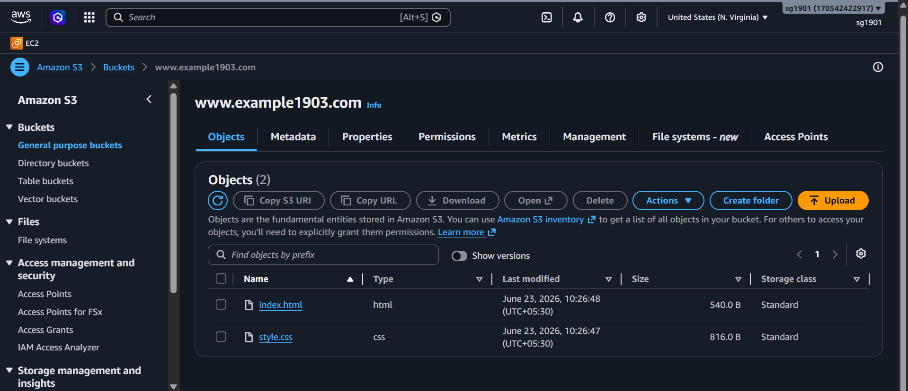
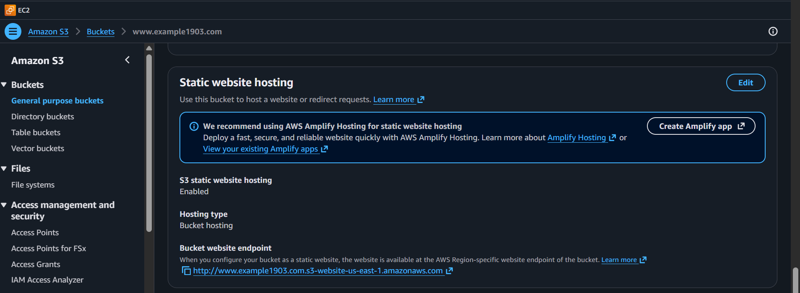
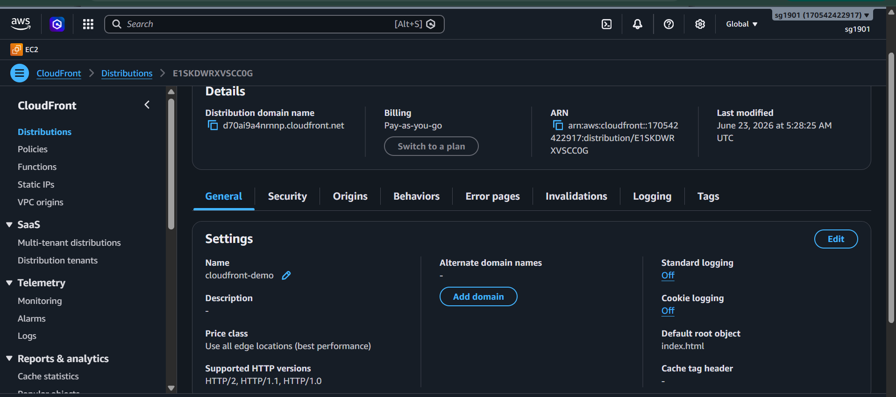
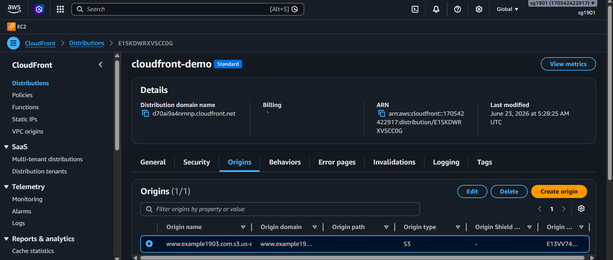
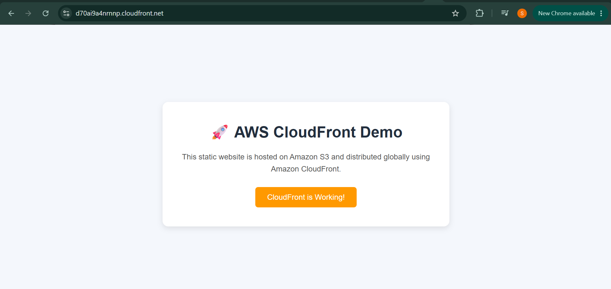

# AWS CloudFront Static Website Hosting

## Overview

This project demonstrates hosting a static website on Amazon S3 and delivering it globally using Amazon CloudFront.

The objective of this exercise was to understand how CloudFront integrates with S3, how content is cached at edge locations, and how static websites can be securely distributed with low latency.

---

## Services Used

- Amazon S3
- Amazon CloudFront

---

## Architecture

User → CloudFront Distribution → S3 Bucket

---

## Implementation Steps

### Step 1: Create Static Website Files

Created a simple static website consisting of:

- `index.html`
- `style.css`

### Step 2: Create an S3 Bucket

Created an S3 bucket and uploaded the website files.

Enabled static website hosting and verified website accessibility.

### Step 3: Create a CloudFront Distribution

Configured CloudFront with the S3 bucket as the origin.

Key configurations:

- Origin Type: Amazon S3
- Origin Access: Enabled
- Cache Settings: Recommended
- Price Class: Default
- HTTP Versions: HTTP/2, HTTP/1.1

### Step 4: Validate Website Access

Verified that the website was successfully served through the CloudFront domain URL.

---

## Screenshots

### S3 Bucket Configuration

---

### Static Website Hosting Enabled

---

### CloudFront General Configuration

---

### CloudFront Origin Configuration

---

### Website Accessed via CloudFront

---

## Key Learnings

- Understood the role of CloudFront as a Content Delivery Network (CDN).
- Learned how CloudFront integrates with Amazon S3.
- Explored origin access concepts for securing S3 content.
- Observed how CloudFront caches content at edge locations to improve website performance.
- Gained hands-on experience configuring and validating a CloudFront distribution.

---

## Cleanup

