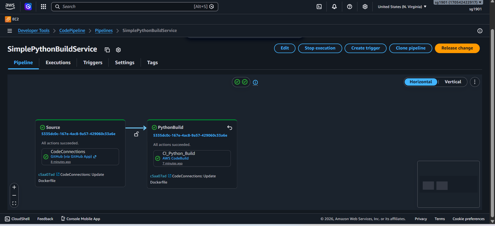
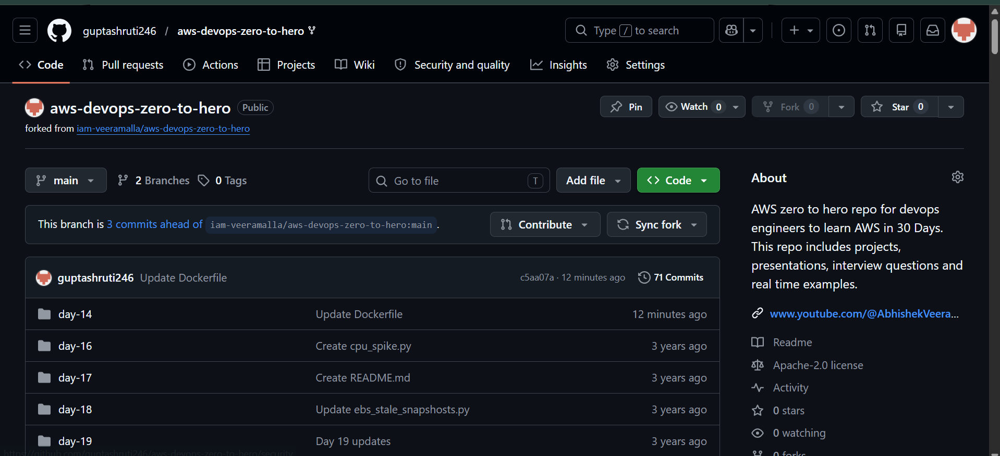
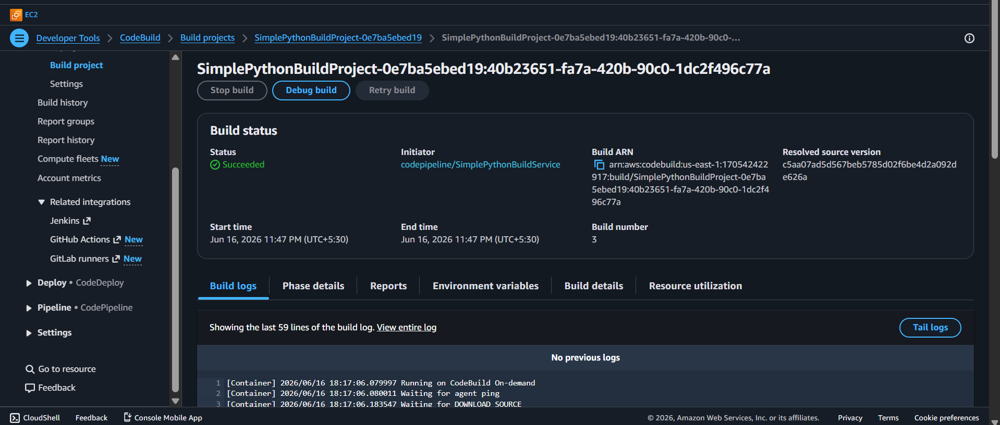

#  AWS CI Pipeline – Python Build Project

This project demonstrates a simple Continuous Integration (CI) pipeline using AWS services. It integrates GitHub with AWS CodePipeline and CodeBuild to automatically build a Python application whenever code is pushed to the repository.

---

##  Project Overview

The CI pipeline automates the following workflow:

GitHub Repository  
→ AWS CodeConnections (Source Stage)  
→ AWS CodePipeline  
→ AWS CodeBuild (Build Stage)  
→ Successful Build Execution

---

## ⚙️ AWS Services Used

- AWS CodePipeline – CI/CD orchestration  
- AWS CodeBuild – Build automation  
- AWS CodeConnections – GitHub integration  
- IAM Roles & Policies – Secure access management  

---

##  What This Project Does

- Automatically triggers pipeline on push to GitHub (main branch)
- Pulls latest code from repository
- Executes build process using AWS CodeBuild
- Runs Python build validation
- Displays build status in AWS Console

---

##  CI Pipeline Flow

GitHub Push  
→ Source Stage (AWS CodeConnections)  
→ Build Stage (AWS CodeBuild)  
→ Build Execution Result (Success / Failure)

---

##  Screenshots

### Pipeline Overview

### Source Stage (GitHub Integration)

### CodeBuild Execution

---

##  Key Learnings

- AWS CI/CD fundamentals  
- CodePipeline workflow orchestration  
- CodeBuild automation for Python projects  
- GitHub integration using CodeConnections  
- IAM roles and AWS permissions  

---

## 📈 Future Improvements

- Add deployment stage (EC2 or S3 hosting)  
- Add automated testing stage  
- Convert into full CI/CD pipeline  
- Add Docker container support  

---

